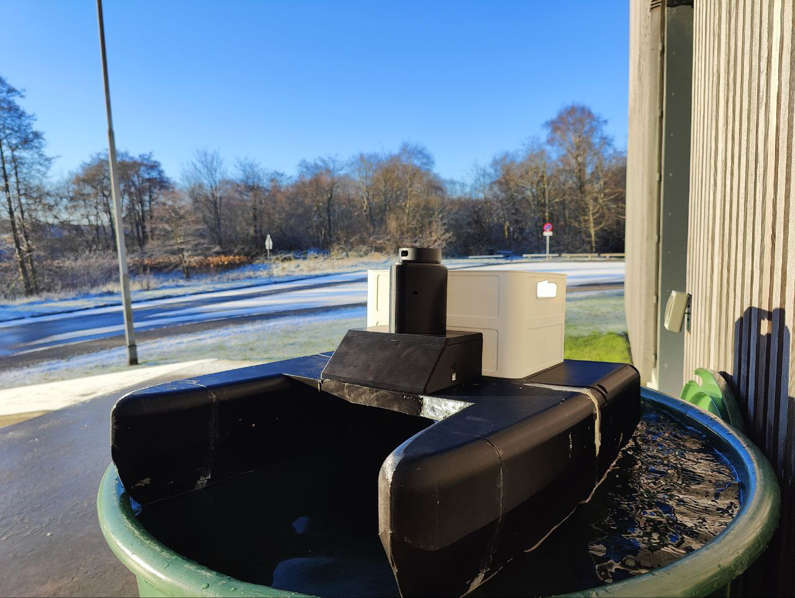
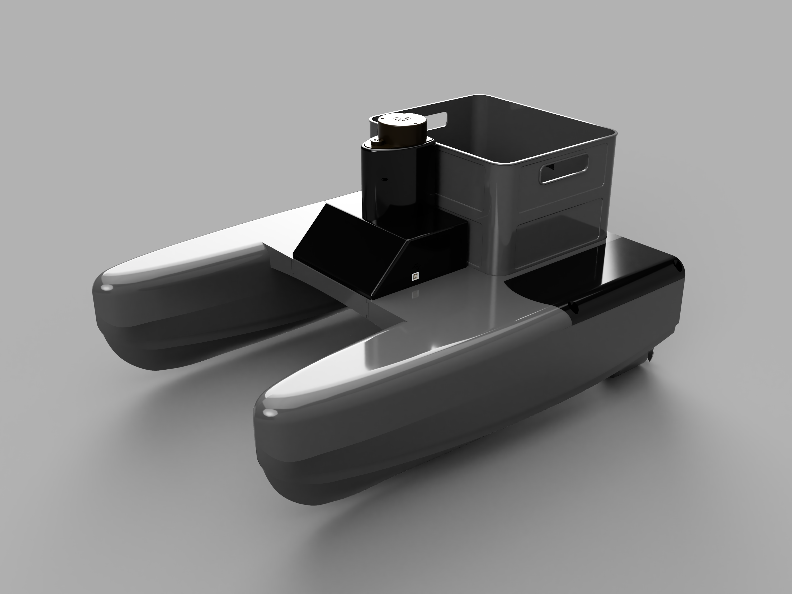
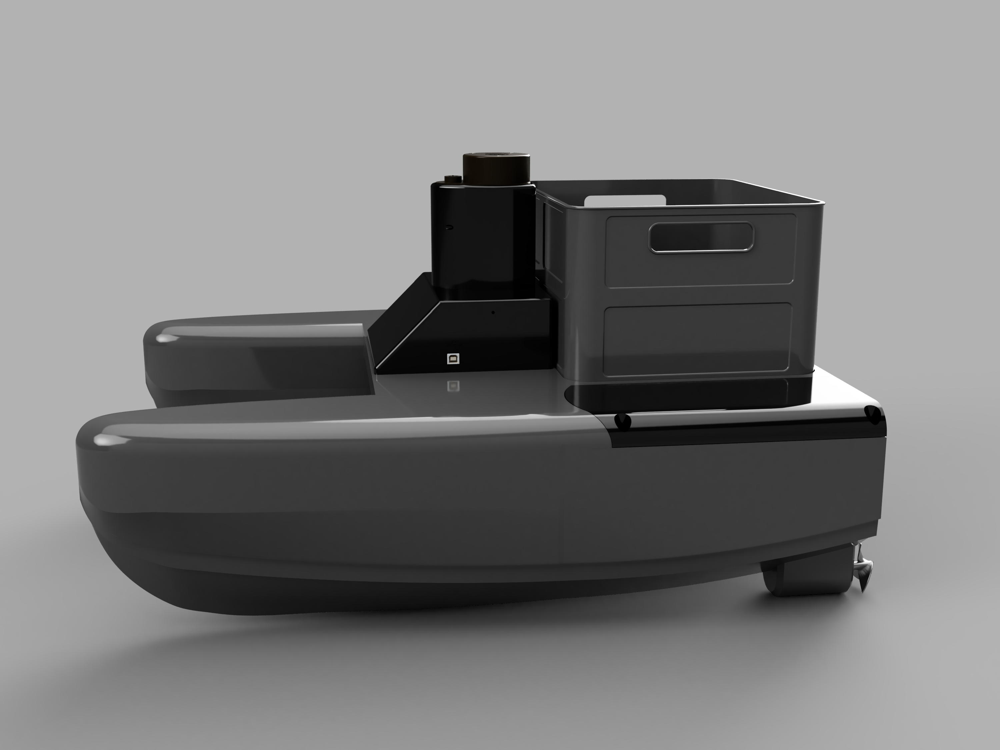

# Autonomous-Catamaran
This is a 3D Printed Catamaran Boat which can avoid obstacle with a complex LIDAR.

All the printed parts required for this project is provided under the related folder.

All the parts are printed in Ultimaker 3 (Extended), so at least 300mm is required in one axis to be ale to print it without any changes. 

Code of the project is also provided under the related section.
Here is a picture of the real boat:

Here are some renderings of the model:

